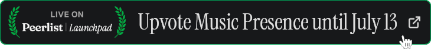

I'm currently working on these apps:

- [**Music Presence**](https://musicpresence.app) &ndash;
  An app that shares media from any media player in your Discord status
  and soon enables you to scrobble that same media to your last.fm profile
- [**Media Control**](https://github.com/ungive/media-control-extension) &ndash;
  A modern browser extension to see and control all media that is playing in your tabs.
  Soon integrates with Music Presence to allow it to share media from websites as well

You can donate to support my work:
[musicpresence.app/donate](https://musicpresence.app/donate?utm_source=github.com&utm_medium=profile)
